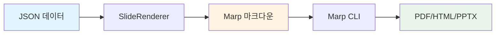
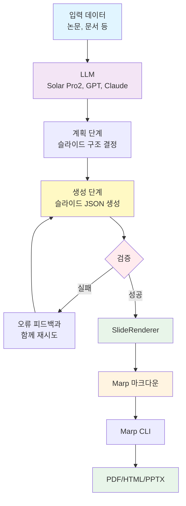

# slide-renderer


**JSON을 Marp 마크다운으로 변환하는 렌더러** - 구조화된 슬라이드 데이터를 Jinja2 템플릿으로 아름다운 Marp 프레젠테이션으로 변환합니다.

[English](README.md) | **한국어**

---

## 개요

slide-renderer는 슬라이드 JSON을 Marp 마크다운 프레젠테이션으로 변환하는 **순수 렌더링 라이브러리**입니다. 핵심 기능은 간단합니다: **JSON → Marp용 마크다운**.

### 핵심 기능

- 🎨 **14가지 슬라이드 타입** - 제목, 리스트, 메트릭, 인용 등
- ✨ **템플릿 기반** - 커스터마이징 가능한 Jinja2 템플릿
- ✅ **타입 안전성** - Pydantic 검증으로 데이터 무결성 보장
- 🚀 **프로덕션 준비** - B-Lab 프레젠테이션의 실제 사례 포함

### 사용 사례

1. **직접 렌더링** - JSON을 직접 작성하여 Marp 마크다운으로 렌더링
2. **LLM 통합** - LLM으로 슬라이드 JSON 생성 후 slide-renderer로 렌더링

---

## 요구사항

### Python 환경

- **Python**: 3.9 이상
- **패키지 매니저**: [uv](https://github.com/astral-sh/uv) (권장) 또는 pip
- **의존성**:
  - `jinja2>=3.0.0` - 템플릿 렌더링
  - `pydantic>=2.0.0,<3.0.0` - 데이터 검증

### Marp CLI (PDF/HTML/PPTX 변환 필수)

**Marp CLI**는 마크다운 파일을 프레젠테이션 포맷으로 변환합니다.

```bash
# npm으로 설치 (Node.js 필요)
npm install -g @marp-team/marp-cli

# 설치 확인
marp --version
```

Node.js가 없다면 [nodejs.org](https://nodejs.org/)에서 다운로드하세요.

### 선택사항: LLM 통합

paper-to-presentation 예제 사용 시:

```bash
# .env 파일 생성
cp .env.example .env

# .env 파일을 편집하여 API 키 추가
UPSTAGE_API_KEY=your-api-key-here
```

**추가 의존성** (자동 설치됨):
- `openai>=1.0.0` - LLM 클라이언트 (Solar Pro2 호환)
- `python-dotenv` - 환경 변수 관리

---

## 설치

### uv 사용 (권장)

[uv](https://github.com/astral-sh/uv)는 빠른 Python 패키지 매니저로 더 나은 성능과 의존성 관리를 제공합니다.

```bash
# 1. uv 설치
curl -LsSf https://astral.sh/uv/install.sh | sh

# 2. 저장소 클론
git clone https://github.com/your-username/slide-renderer.git
cd slide-renderer

# 3. 가상 환경 생성 및 의존성 설치
uv venv
source .venv/bin/activate  # Windows: .venv\Scripts\activate
uv pip install -e .

# 4. 개발 도구 포함 설치
uv pip install -e ".[dev]"
```

### pip 사용

```bash
# 클론 및 설치
git clone https://github.com/your-username/slide-renderer.git
cd slide-renderer
pip install -e .
```

### 설치 확인

```bash
# 임포트 테스트
python -c "from slide_renderer import SlideRenderer; print('✓ 설치 완료')"

# 예제 실행
python examples/basic_usage.py
```

---

## 워크플로우

### 워크플로우 1: 직접 렌더링

LLM 없이 JSON을 직접 Marp 마크다운으로 변환합니다.



**예제**:

```python
from slide_renderer import SlideRenderer

# 렌더러 생성
renderer = SlideRenderer()

# 슬라이드 데이터 정의
slides = [
    {
        "type": "title_slide",
        "content": {
            "title": "나의 프레젠테이션",
            "subtitle": "slide-renderer로 제작"
        }
    },
    {
        "type": "vertical_list",
        "content": {
            "title": "주요 기능",
            "items": [
                {"title": "빠름", "description": "고성능 렌더링"},
                {"title": "간단함", "description": "사용하기 쉬운 인터페이스"},
                {"title": "유연함", "description": "커스터마이징 가능한 템플릿"}
            ]
        }
    }
]

# 마크다운으로 렌더링
markdown = renderer.render_presentation(slides, validate=True)

# 파일로 저장
with open("presentation.md", "w") as f:
    f.write(markdown)
```

**예제 실행**:

```bash
python examples/basic_usage.py
```

### 워크플로우 2: LLM 기반 생성

LLM으로 슬라이드 JSON을 생성한 후 slide-renderer로 렌더링합니다.



**예제: 논문을 프레젠테이션으로 변환**

`paper_to_presentation` 모듈이 이 워크플로우를 시연합니다:

```bash
# API 키 설정
export UPSTAGE_API_KEY="your-api-key"

# 변환기 실행
python examples/paper_to_presentation.py --language ko --slides 10

# 또는 Makefile 사용
make paper
```

**아키텍처**:

```python
from paper_to_presentation import convert_paper_to_presentation
import json

# 논문 데이터 로드
with open("sample_data/usecase/paper/attention_is_all_you_need.json") as f:
    paper_data = json.load(f)

# 변환: 논문 → LLM → JSON → 마크다운
await convert_paper_to_presentation(
    paper_data=paper_data,
    output_file="presentation.md",
    max_slides=10,
    target_language="ko"
)
```

**2단계 생성 방식**:

1. **1단계 - 계획**: LLM이 입력을 분석하고 슬라이드 타입/구조 결정
2. **2단계 - 생성**: 각 슬라이드를 JSON으로 비동기 병렬 생성
3. **검증**: Pydantic으로 JSON 스키마 검증 (실패 시 자동 재시도)
4. **렌더링**: slide-renderer가 검증된 JSON을 Marp 마크다운으로 변환

**주요 기능**:
- ✅ 비동기 병렬 생성 (더 빠름)
- ✅ Figure ID 시스템 (LLM이 ID 선택, 시스템이 URL로 변환)
- ✅ 오류 피드백과 함께 검증 재시도
- ✅ 다국어 지원 (ko, en, ja, zh, es, fr, de)

자세한 내용은 [src/paper_to_presentation/README.md](src/paper_to_presentation/README.md)를 참고하세요.

---

## 빠른 시작

### 1. 샘플 데이터로 시작하기

프로덕션 예제로 JSON 구조를 학습합니다:

```python
import json
from slide_renderer import SlideRenderer

# 샘플 데이터 로드 (14가지 슬라이드 타입)
with open("sample_data/sample_slides.json") as f:
    samples = json.load(f)

# 렌더러 생성
renderer = SlideRenderer()

# 단일 슬라이드 렌더링
markdown = renderer.render("title_slide", samples["title_slide"])
print(markdown)

# 여러 슬라이드 렌더링
slides = [
    {"type": "title_slide", "content": samples["title_slide"]},
    {"type": "vertical_list", "content": samples["vertical_list"]},
    {"type": "quote", "content": samples["quote"]}
]

# 프레젠테이션 저장
renderer.save_presentation(slides, "output.md")
```

### 2. 프레젠테이션 포맷으로 변환

Marp CLI로 마크다운을 PDF/HTML/PPTX로 변환합니다:

```bash
# Marp CLI 설치 (Node.js 필요)
npm install -g @marp-team/marp-cli

# PDF로 변환
marp --theme custom-style.css output.md --pdf

# HTML로 변환
marp --theme custom-style.css output.md --html

# 또는 Makefile 사용
make render-pdf MARKDOWN_FILE=output.md
make render-html MARKDOWN_FILE=output.md
```

---

## 슬라이드 타입

slide-renderer는 **14가지 슬라이드 타입**을 지원합니다:

| 슬라이드 타입 | 사용 사례 | 구성 요소 |
|------------|----------|------------|
| `title_slide` | 프레젠테이션 오프닝 | 제목 + 부제목 |
| `section_title` | 섹션 구분 | 제목만 |
| `single_content_with_image` | 기능 강조 | 콘텐츠 + 이미지 1개 |
| `highlight` | 핵심 메시지, CTA | 제목 + 설명 |
| `two_column_list` | 양옆 비교 | 2-4개 항목 |
| `vertical_list` | 상세 기능 | 3-6개 항목 |
| `horizontal_3_column_list` | 3가지 비교 | 3개 컬럼 |
| `two_columns_with_grid` | 2x2 매트릭스 | 4개 항목 (그리드) |
| `horizontal_4_column_list` | 4단계 프로세스 | 4개 컬럼 |
| `image_with_description_2` | 전/후 비교 | 2개 이미지 + 텍스트 |
| `image_with_description_3` | 제품 갤러리 | 3개 이미지 + 텍스트 |
| `three_column_metrics` | KPI 대시보드 | 3개 메트릭 |
| `metrics_grid` | 분기별 메트릭 | 4개 메트릭 (2x2) |
| `quote` | 추천사, 인용구 | 인용구 + 저자 |

각 타입의 JSON 예제는 [sample_data/README.md](sample_data/README.md)를 참고하세요.

---

## 사용 가이드

### SlideRenderer

메인 렌더링 클래스:

```python
from slide_renderer import SlideRenderer

renderer = SlideRenderer(template_dir=None)
```

**메서드**:

```python
# 단일 슬라이드 렌더링
markdown = renderer.render(
    slide_type="title_slide",
    content={"title": "안녕하세요", "subtitle": "세계"},
    validate=True
)

# 여러 슬라이드 렌더링
markdown = renderer.render_presentation(
    slides=[...],
    validate=True,
    include_frontmatter=True
)

# 파일로 저장
renderer.save_presentation(
    slides=[...],
    output_file="presentation.md",
    validate=True
)

# 콘텐츠 검증
validated = renderer.validate_content(
    slide_type="title_slide",
    content={...}
)
```

### 콘텐츠 스키마

Pydantic 모델 및 JSON 스키마 접근:

```python
from slide_renderer import (
    SLIDE_CONTENT_MODELS,    # Dict[str, Type[BaseModel]]
    get_content_model,       # 타입명으로 모델 가져오기
    get_json_schema,         # LLM 통합용 JSON 스키마
    get_all_schemas,         # 모든 스키마 가져오기
)

# LLM 통합용 스키마 가져오기
schema = get_json_schema("metrics_grid")

# 모든 슬라이드 타입 스키마
all_schemas = get_all_schemas()
```

### 슬라이드 타입

```python
from slide_renderer import SlideTypeEnum

# 사용 가능한 모든 타입 나열
all_types = list(SlideTypeEnum)
print([t.value for t in all_types])
# ['title_slide', 'section_title', 'single_content_with_image', ...]
```

---

## 프로젝트 구조

```
slide-renderer/
├── src/
│   ├── slide_renderer/          # 핵심 렌더링 라이브러리
│   │   ├── __init__.py          # 공개 인터페이스
│   │   ├── renderer.py          # SlideRenderer 클래스
│   │   ├── types.py             # SlideTypeEnum
│   │   └── schemas/             # Pydantic 모델
│   │       └── content.py       # 14개 슬라이드 콘텐츠 모델
│   │
│   └── paper_to_presentation/   # 예제: LLM 통합
│       ├── __init__.py          # 공개 인터페이스
│       ├── converter.py         # 메인 오케스트레이션
│       ├── planning.py          # 1단계: 계획
│       ├── generator.py         # 2단계: 생성
│       ├── renderer.py          # 마크다운 출력
│       ├── models.py            # Pydantic 모델
│       └── utils.py             # 유틸리티
│
├── templates/                   # 14개 Jinja2 템플릿
├── sample_data/                 # 프로덕션 예제
│   ├── sample_slides.json       # 14가지 슬라이드 타입 예제
│   └── usecase/paper/           # 논문 JSON 예제
├── reference_slides/            # 예상 마크다운 출력
├── examples/                    # 사용 예제
│   ├── basic_usage.py          # 직접 렌더링
│   └── paper_to_presentation.py # LLM 통합
├── tests/                      # 테스트 스위트
│   └── test_renderer.py        # 핵심 테스트
├── Makefile                    # 빌드 명령어
├── pyproject.toml              # 패키지 설정
└── README.md                   # 이 파일
```

---

## 개발

### uv로 설정하기

```bash
# uv 설치
curl -LsSf https://astral.sh/uv/install.sh | sh

# 환경 생성
uv venv
source .venv/bin/activate

# 개발 의존성 포함 설치
uv pip install -e ".[dev]"
```

### 테스트 실행

```bash
# 테스트 실행
pytest tests/

# 커버리지 포함
pytest tests/ --cov=slide_renderer --cov-report=term-missing
```

### 코드 품질

```bash
# 코드 포맷팅
ruff format .

# 린트
ruff check .

# 타입 체킹
mypy src/
```

---

## 예제

### 기본 렌더링

```bash
# 기본 예제 실행
python examples/basic_usage.py

# 또는 Makefile 사용
make basic
```

### LLM 통합

```bash
# API 키 설정
export UPSTAGE_API_KEY="your-key"

# 논문 변환기 실행
python examples/paper_to_presentation.py --language ko --slides 10

# 또는 Makefile 사용
make paper
```

### 전체 워크플로우

```bash
# 한 번에 생성 + 렌더링
make demo
```

---

## 커스텀 템플릿

필요에 맞게 Jinja2 템플릿을 커스터마이징:

```python
from slide_renderer import SlideRenderer

# 커스텀 템플릿 디렉토리 사용
renderer = SlideRenderer(template_dir="my_templates/")

# 또는 templates/ 디렉토리의 기존 템플릿 수정
```

템플릿은 `templates/{slide_type}.jinja2`에 위치합니다. 템플릿 변수는 Pydantic 스키마 필드와 일치합니다.

---

## 라이선스

MIT License - 자세한 내용은 [LICENSE](LICENSE) 파일을 참고하세요.

---

## 관련 프로젝트

- [Marp](https://marp.app/) - 마크다운 프레젠테이션 에코시스템
- [marp-cli](https://github.com/marp-team/marp-cli) - Marp CLI
- [uv](https://github.com/astral-sh/uv) - 빠른 Python 패키지 매니저

---

## 지원

- 📖 [문서](https://github.com/your-username/slide-renderer#readme)
- 🐛 [이슈](https://github.com/your-username/slide-renderer/issues)
- 💬 [토론](https://github.com/your-username/slide-renderer/discussions)

---

**Made with ❤️ by the B-Lab Team**
