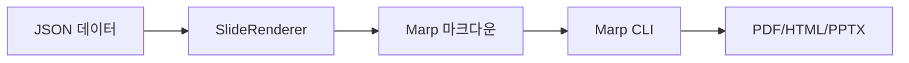
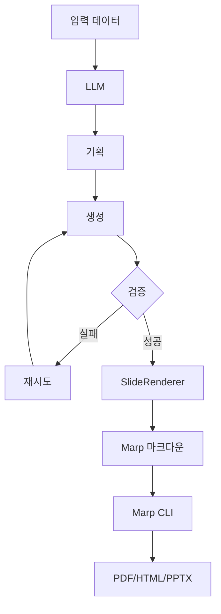

# slide-renderer


**JSON to Marp Markdown 렌더러** - 구조화된 슬라이드 데이터를 아름다운 Marp 프레젠테이션으로 변환합니다.

[English](README.md) | **한국어**

---

## 빠른 시작

### 설치

```bash
# uv 설치 (권장)
curl -LsSf https://astral.sh/uv/install.sh | sh

# 클론 및 설치
git clone https://github.com/your-username/slide-renderer.git
cd slide-renderer
uv venv
source .venv/bin/activate
uv pip install -e .
```

### 기본 사용법

#### CLI (커맨드 라인)

```bash
# JSON을 Markdown으로 렌더링
slide-renderer -i slides.json -o presentation.md

# 또는 파이핑 사용
cat slides.json | slide-renderer > presentation.md
```

#### Python API

```python
import json
from slide_renderer import SlideRenderer

# 샘플 슬라이드 로드 (딕셔너리 형식: slide_type -> content)
with open("sample_data/sample_slides.json") as f:
    sample_data = json.load(f)

# 프레젠테이션 형식으로 변환: [{"type": slide_type, "content": {...}}, ...]
slides = [{"type": slide_type, "content": content}
          for slide_type, content in sample_data.items()]

# 렌더러 생성 및 렌더링
renderer = SlideRenderer()
markdown = renderer.render_presentation(slides, validate=True)

# 파일로 저장
with open("presentation.md", "w") as f:
    f.write(markdown)
```

**JSON 스키마 형식**:

렌더러는 슬라이드 객체 배열을 입력받습니다. 각 슬라이드는:
- `type`: 슬라이드 타입 식별자 ([슬라이드 타입](#슬라이드-타입--콘텐츠-스키마) 참조)
- `content`: 타입별 콘텐츠 객체

```json
[
  {
    "type": "title_slide",
    "content": {
      "title": "프레젠테이션 제목",
      "subtitle": "부제목 텍스트"
    }
  },
  {
    "type": "two_column_list",
    "content": {
      "title": "기능",
      "items": [
        {"title": "항목 1", "description": "설명 1"},
        {"title": "항목 2", "description": "설명 2"}
      ]
    }
  }
]
```

### PDF/HTML/PPTX로 변환

```bash
# Marp CLI 설치 (Node.js 필요)
npm install -g @marp-team/marp-cli

# PDF로 변환
marp --theme custom-style.css presentation.md --pdf

# 또는 Makefile 단축 명령 사용
make render-pdf MARKDOWN_FILE=presentation.md
```

---

## 개요

slide-renderer는 Jinja2 템플릿을 사용하여 **JSON → Marp Markdown** 변환을 수행합니다.

### 핵심 기능

- 🎨 **14가지 슬라이드 타입** - 제목, 리스트, 지표, 인용구, 이미지
- ✨ **템플릿 기반** - 커스터마이징 가능한 Jinja2 템플릿
- ✅ **타입 안전** - Pydantic 검증
- 🚀 **프로덕션 준비** - 실제 사례 기반

### 워크플로우

#### 워크플로우 1: 직접 렌더링



#### 워크플로우 2: LLM 통합



---

## 슬라이드 타입 & 콘텐츠 스키마

각 슬라이드 타입은 특정 콘텐츠 스키마를 가집니다. 모든 슬라이드는 다음 형식을 따릅니다:

```json
{
  "type": "slide_type_name",
  "content": {
    // 타입별 필드
  }
}
```

| 슬라이드 타입 | 사용 사례 | 항목 수 |
|------------|----------|---------|
| `title_slide` | 프레젠테이션 시작 | - |
| `section_title` | 섹션 구분 | - |
| `highlight` | 핵심 메시지 | - |
| `two_column_list` | 양측 리스트 | 2-4개 항목 |
| `vertical_list` | 상세 기능 설명 | 3-6개 항목 |
| `horizontal_3_column_list` | 3가지 비교 | 3개 항목 |
| `horizontal_4_column_list` | 4단계 프로세스 | 4개 항목 |
| `two_columns_with_grid` | 2x2 매트릭스 | 4개 항목 |
| `single_content_with_image` | 기능 강조 | 1개 이미지 |
| `image_with_description_2` | 전후 비교 | 2개 이미지 |
| `image_with_description_3` | 제품 갤러리 | 3개 이미지 |
| `three_column_metrics` | KPI 대시보드 | 3개 지표 |
| `metrics_grid` | 분기별 지표 | 4개 지표 |
| `quote` | 추천사 | - |

### 콘텐츠 스키마 상세

상세한 스키마 사양은 [sample_data/README.md](sample_data/README.md)를 참조하세요.

**슬라이드 구조 예시**:
```json
{
  "type": "two_column_list",
  "content": {
    "title": "기능",
    "items": [
      {"title": "기능 1", "description": "설명 1"},
      {"title": "기능 2", "description": "설명 2"}
    ]
  }
}
```

**필드 제약 조건**:
- `title`: 40-80자 (슬라이드 타입에 따라 다름)
- `description`: 최대 300자
- `items`: 2-6개 항목 (슬라이드 타입에 따라 다름)
- `metrics`: 3-4개 지표 (슬라이드 타입에 따라 다름)

전체 Pydantic 스키마는 [src/slide_renderer/schemas/content.py](src/slide_renderer/schemas/content.py)를 참조하세요.

---

## 요구사항

### Python 환경

- **Python**: 3.9+
- **패키지 매니저**: [uv](https://github.com/astral-sh/uv) (권장) 또는 pip
- **의존성**: `jinja2>=3.0.0`, `pydantic>=2.0.0`

### Marp CLI (PDF/HTML/PPTX용)

```bash
npm install -g @marp-team/marp-cli
```

Node.js가 필요한 경우 [nodejs.org](https://nodejs.org/)에서 다운로드하세요.

### 선택사항: LLM 통합

```bash
# .env 파일 생성
cp .env.example .env

# API 키 추가
UPSTAGE_API_KEY=your-api-key-here
```

---

## 예제

### CLI 예제

```bash
# 예제 프레젠테이션 렌더링
slide-renderer -i examples/cli_example.json -o examples/cli_example.md --verbose

# Marp로 보기
marp examples/cli_example.md --watch

# PDF로 내보내기
marp examples/cli_example.md -o output.pdf --theme custom-style.css
```

상세한 CLI 문서는 [CLI_USAGE.md](CLI_USAGE.md)를 참조하세요.

### Python 예제 실행

```bash
# 기본 렌더링
python examples/basic_usage.py

# LLM 통합 (API 키 필요)
export UPSTAGE_API_KEY="your-key"
python examples/paper_to_presentation.py --language ko --slides 10

# 또는 Makefile 사용
make basic
make paper
make demo  # 생성 + 렌더링
```

### 샘플 데이터

```python
import json
from slide_renderer import SlideRenderer

# 샘플 슬라이드 로드
with open("sample_data/sample_slides.json") as f:
    samples = json.load(f)

renderer = SlideRenderer()

# 단일 슬라이드 렌더링
markdown = renderer.render("title_slide", samples["title_slide"])

# 프레젠테이션 렌더링
slides = [
    {"type": "title_slide", "content": samples["title_slide"]},
    {"type": "quote", "content": samples["quote"]}
]
renderer.save_presentation(slides, "output.md")
```

---

## 참조

### SlideRenderer

```python
from slide_renderer import SlideRenderer

renderer = SlideRenderer(template_dir=None)

# 단일 슬라이드 렌더링
markdown = renderer.render(
    slide_type="title_slide",
    content={"title": "안녕", "subtitle": "세상"},
    validate=True
)

# 프레젠테이션 렌더링
markdown = renderer.render_presentation(
    slides=[...],
    validate=True,
    include_frontmatter=True
)

# 파일로 저장
renderer.save_presentation(
    slides=[...],
    output_file="presentation.md",
    validate=True
)
```

### 콘텐츠 스키마

```python
from slide_renderer import (
    SLIDE_CONTENT_MODELS,
    get_content_model,
    get_json_schema,
    get_all_schemas,
    SlideTypeEnum
)

# LLM용 JSON 스키마 가져오기
schema = get_json_schema("metrics_grid")

# 모든 스키마 가져오기
all_schemas = get_all_schemas()

# 슬라이드 타입 목록
all_types = list(SlideTypeEnum)
```

---

## LLM 통합

### 논문을 프레젠테이션으로

`paper_to_presentation` 모듈은 LLM 기반 슬라이드 생성을 시연합니다:

```bash
# API 키 설정
export UPSTAGE_API_KEY="your-key"

# 변환기 실행
python examples/paper_to_presentation.py --language ko --slides 10

# 또는 Makefile 사용
make paper
```

### 아키텍처

```python
from paper_to_presentation import convert_paper_to_presentation
import json

# 논문 데이터 로드
with open("sample_data/usecase/paper/attention_is_all_you_need.json") as f:
    paper_data = json.load(f)

# 변환: 논문 → LLM → JSON → 마크다운
await convert_paper_to_presentation(
    paper_data=paper_data,
    output_file="presentation.md",
    max_slides=10,
    target_language="ko"
)
```

### 2단계 생성

1. **기획 단계**: LLM이 입력을 분석하고 슬라이드 구조 결정
2. **생성 단계**: 슬라이드 JSON 비동기 병렬 생성
3. **검증**: Pydantic 자동 재시도 검증
4. **렌더링**: JSON을 Marp 마크다운으로 변환

**기능**:
- 비동기 병렬 생성
- Figure ID 시스템 (LLM이 ID 선택 → URL)
- 오류 피드백을 통한 검증 재시도
- 다국어 지원 (ko, en, ja, zh, es, fr, de)

자세한 내용은 [src/paper_to_presentation/README.md](src/paper_to_presentation/README.md)를 참조하세요.

---

## 개발

### 설정

```bash
# 개발 의존성 포함 설치
curl -LsSf https://astral.sh/uv/install.sh | sh
uv venv
source .venv/bin/activate
uv pip install -e ".[dev]"
```

### 테스트

```bash
# 테스트 실행
pytest tests/

# 커버리지 포함
pytest tests/ --cov=slide_renderer --cov-report=term-missing
```

### 코드 품질

```bash
# 포맷
ruff format .

# 린트
ruff check .

# 타입 체크
mypy src/
```

---

## 프로젝트 구조

```
slide-renderer/
├── src/
│   ├── slide_renderer/          # 핵심 라이브러리
│   │   ├── renderer.py          # SlideRenderer 클래스
│   │   ├── types.py             # SlideTypeEnum
│   │   └── schemas/content.py   # 14가지 슬라이드 모델
│   └── paper_to_presentation/   # LLM 통합 예제
│       ├── converter.py         # 메인 오케스트레이션
│       ├── planning.py          # 1단계: 기획
│       └── generator.py         # 2단계: 생성
├── templates/                   # 14개 Jinja2 템플릿
├── sample_data/                 # 프로덕션 예제
├── examples/                    # 사용 예제
└── tests/                       # 테스트 스위트
```

---

## 커스텀 템플릿

Jinja2 템플릿 커스터마이징:

```python
from slide_renderer import SlideRenderer

# 커스텀 템플릿 디렉토리 사용
renderer = SlideRenderer(template_dir="my_templates/")

# 또는 templates/ 디렉토리 직접 수정
```

템플릿 위치: `templates/{slide_type}.jinja2`


---

**Made with ❤️ by the B-Lab Team**
