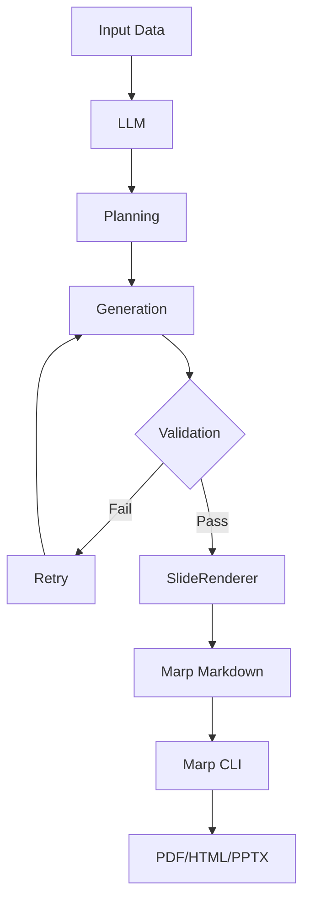

# slide-renderer


**JSON to Marp Markdown renderer** - Convert structured slide data into beautiful Marp presentations.

**English** | [한국어](README.ko.md)

---

## Quick Start

### Installation

```bash
# Install uv (recommended)
curl -LsSf https://astral.sh/uv/install.sh | sh

# Clone and install
git clone https://github.com/your-username/slide-renderer.git
cd slide-renderer
uv venv
source .venv/bin/activate
uv pip install -e .
```

### Basic Usage

```python
from slide_renderer import SlideRenderer

# Create renderer
renderer = SlideRenderer()

# Define slides
slides = [
    {
        "type": "title_slide",
        "content": {
            "title": "My Presentation",
            "subtitle": "Built with slide-renderer"
        }
    },
    {
        "type": "vertical_list",
        "content": {
            "title": "Key Features",
            "items": [
                {"title": "Fast", "description": "High performance"},
                {"title": "Simple", "description": "Easy to use"}
            ]
        }
    }
]

# Render to markdown
markdown = renderer.render_presentation(slides, validate=True)

# Save to file
with open("presentation.md", "w") as f:
    f.write(markdown)
```

### Convert to PDF/HTML/PPTX

```bash
# Install Marp CLI (requires Node.js)
npm install -g @marp-team/marp-cli

# Convert to PDF
marp --theme custom-style.css presentation.md --pdf

# Or use Makefile shortcuts
make render-pdf MARKDOWN_FILE=presentation.md
```

---

## Overview

slide-renderer converts **JSON → Marp Markdown** with Jinja2 templates.

### Core Features

- 🎨 **14 Slide Types** - Title, lists, metrics, quotes, images
- ✨ **Template-Based** - Customizable Jinja2 templates
- ✅ **Type-Safe** - Pydantic validation
- 🚀 **Production-Ready** - Real-world examples

### Workflows

#### Workflow 1: Direct Rendering


#### Workflow 2: LLM Integration



---

## Slide Types

| Slide Type | Use Case | Components |
|------------|----------|------------|
| `title_slide` | Presentation opening | Title + Subtitle |
| `section_title` | Section breaks | Title only |
| `vertical_list` | Detailed features | 3-6 items |
| `two_column_list` | Side-by-side comparison | 2-4 items |
| `horizontal_3_column_list` | Three-way comparison | 3 columns |
| `horizontal_4_column_list` | Four-step process | 4 columns |
| `two_columns_with_grid` | 2x2 matrix | 4 items |
| `single_content_with_image` | Feature spotlight | Content + image |
| `image_with_description_2` | Before/after | 2 images + texts |
| `image_with_description_3` | Product gallery | 3 images + texts |
| `three_column_metrics` | KPI dashboard | 3 metrics |
| `metrics_grid` | Quarterly metrics | 4 metrics (2x2) |
| `quote` | Testimonials | Quote + Author |
| `highlight` | Key messages | Title + Description |

### Content Schema Details

See detailed schema specifications in [sample_data/README.md](sample_data/README.md).

**Example slide structure**:
```json
{
  "type": "two_column_list",
  "content": {
    "title": "Features",
    "items": [
      {"title": "Feature 1", "description": "Description 1"},
      {"title": "Feature 2", "description": "Description 2"}
    ]
  }
}
```

**Field constraints**:
- `title`: 40-80 chars (depending on slide type)
- `description`: max 300 chars
- `items`: 2-6 items (depending on slide type)
- `metrics`: 3-4 metrics (depending on slide type)

See [src/slide_renderer/schemas/content.py](src/slide_renderer/schemas/content.py) for complete Pydantic schemas.

---

## Requirements

### Python Environment

- **Python**: 3.9+
- **Package Manager**: [uv](https://github.com/astral-sh/uv) (recommended) or pip
- **Dependencies**: `jinja2>=3.0.0`, `pydantic>=2.0.0`

### Marp CLI (For PDF/HTML/PPTX)

```bash
npm install -g @marp-team/marp-cli
```

Download Node.js from [nodejs.org](https://nodejs.org/) if needed.

### Optional: LLM Integration

```bash
# Create .env file
cp .env.example .env

# Add API key
UPSTAGE_API_KEY=your-api-key-here
```

---

## Examples

### Run Examples

```bash
# Basic rendering
python examples/basic_usage.py

# LLM integration (requires API key)
export UPSTAGE_API_KEY="your-key"
python examples/paper_to_presentation.py --language ko --slides 10

# Or use Makefile
make basic
make paper
make demo  # Generate + Render
```

### Sample Data

```python
import json
from slide_renderer import SlideRenderer

# Load sample slides
with open("sample_data/sample_slides.json") as f:
    samples = json.load(f)

renderer = SlideRenderer()

# Render single slide
markdown = renderer.render("title_slide", samples["title_slide"])

# Render presentation
slides = [
    {"type": "title_slide", "content": samples["title_slide"]},
    {"type": "quote", "content": samples["quote"]}
]
renderer.save_presentation(slides, "output.md")
```

---

## Reference

### SlideRenderer

```python
from slide_renderer import SlideRenderer

renderer = SlideRenderer(template_dir=None)

# Render single slide
markdown = renderer.render(
    slide_type="title_slide",
    content={"title": "Hello", "subtitle": "World"},
    validate=True
)

# Render presentation
markdown = renderer.render_presentation(
    slides=[...],
    validate=True,
    include_frontmatter=True
)

# Save to file
renderer.save_presentation(
    slides=[...],
    output_file="presentation.md",
    validate=True
)
```

### Content Schemas

```python
from slide_renderer import (
    SLIDE_CONTENT_MODELS,
    get_content_model,
    get_json_schema,
    get_all_schemas,
    SlideTypeEnum
)

# Get JSON schema for LLM
schema = get_json_schema("metrics_grid")

# Get all schemas
all_schemas = get_all_schemas()

# List slide types
all_types = list(SlideTypeEnum)
```

---

## LLM Integration

### Paper to Presentation

The `paper_to_presentation` module demonstrates LLM-powered slide generation:

```bash
# Set API key
export UPSTAGE_API_KEY="your-key"

# Run converter
python examples/paper_to_presentation.py --language ko --slides 10

# Or use Makefile
make paper
```

### Architecture

```python
from paper_to_presentation import convert_paper_to_presentation
import json

# Load paper data
with open("sample_data/usecase/paper/attention_is_all_you_need.json") as f:
    paper_data = json.load(f)

# Convert: Paper → LLM → JSON → Markdown
await convert_paper_to_presentation(
    paper_data=paper_data,
    output_file="presentation.md",
    max_slides=10,
    target_language="ko"
)
```

### 2-Phase Generation

1. **Planning Phase**: LLM analyzes input and decides slide structure
2. **Generation Phase**: Async parallel generation of slide JSON
3. **Validation**: Pydantic validates with auto-retry
4. **Rendering**: Convert JSON to Marp markdown

**Features**:
- Async parallel generation
- Figure ID system (LLM selects IDs → URLs)
- Validation retry with error feedback
- Multi-language support (ko, en, ja, zh, es, fr, de)

See [src/paper_to_presentation/README.md](src/paper_to_presentation/README.md) for details.

---

## Development

### Setup

```bash
# Install with dev dependencies
curl -LsSf https://astral.sh/uv/install.sh | sh
uv venv
source .venv/bin/activate
uv pip install -e ".[dev]"
```

### Testing

```bash
# Run tests
pytest tests/

# With coverage
pytest tests/ --cov=slide_renderer --cov-report=term-missing
```

### Code Quality

```bash
# Format
ruff format .

# Lint
ruff check .

# Type check
mypy src/
```

---

## Project Structure

```
slide-renderer/
├── src/
│   ├── slide_renderer/          # Core library
│   │   ├── renderer.py          # SlideRenderer class
│   │   ├── types.py             # SlideTypeEnum
│   │   └── schemas/content.py   # 14 slide models
│   └── paper_to_presentation/   # LLM integration example
│       ├── converter.py         # Main orchestration
│       ├── planning.py          # Phase 1: Planning
│       └── generator.py         # Phase 2: Generation
├── templates/                   # 14 Jinja2 templates
├── sample_data/                 # Production examples
├── examples/                    # Usage examples
└── tests/                       # Test suite
```

---

## Custom Templates

Customize Jinja2 templates:

```python
from slide_renderer import SlideRenderer

# Use custom template directory
renderer = SlideRenderer(template_dir="my_templates/")

# Or modify templates/ directory
```

Templates: `templates/{slide_type}.jinja2`

---

**Made by the B-Lab Team**
