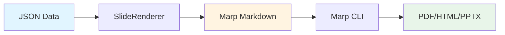
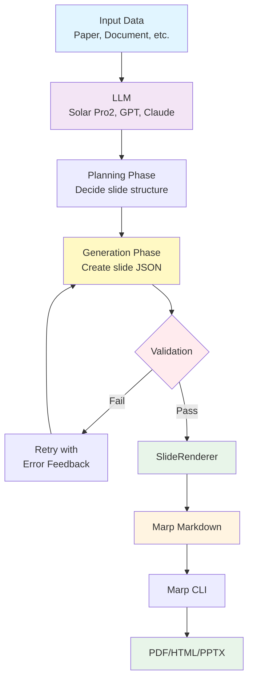

# slide-renderer


**JSON to Marp Markdown renderer** - Convert structured slide data into beautiful Marp presentations with Jinja2 templates.

**English** | [한국어](README.ko.md)

---

## Overview

slide-renderer is a **pure rendering library** that converts slide JSON to Marp markdown presentations. The core functionality is simple: **JSON → Markdown for Marp**.

### Core Features

- 🎨 **14 Slide Types** - Title, lists, metrics, quotes, images, and more
- ✨ **Template-Based** - Customizable Jinja2 templates
- ✅ **Type-Safe** - Pydantic validation ensures data integrity
- 🚀 **Production-Ready** - Real-world examples from B-Lab presentations

### Use Cases

1. **Direct Rendering** - Manually create JSON and render to Marp markdown
2. **LLM Integration** - Generate slide JSON with LLMs, then render with slide-renderer

---

## Installation

### Using uv (Recommended)

[uv](https://github.com/astral-sh/uv) is a fast Python package manager. We recommend using it for better performance and dependency management.

```bash
# Install uv if you haven't already
curl -LsSf https://astral.sh/uv/install.sh | sh

# Clone the repository
git clone https://github.com/your-username/slide-renderer.git
cd slide-renderer

# Create virtual environment and install dependencies
uv venv
source .venv/bin/activate  # On Windows: .venv\Scripts\activate
uv pip install -e .

# For development with additional tools
uv pip install -e ".[dev]"
```

### Using pip

```bash
# Clone and install
git clone https://github.com/your-username/slide-renderer.git
cd slide-renderer
pip install -e .
```

---

## Workflows

### Workflow 1: Direct Rendering

Convert JSON directly to Marp markdown without LLM involvement.



**Example**:

```python
from slide_renderer import SlideRenderer

# Create renderer
renderer = SlideRenderer()

# Define slide data
slides = [
    {
        "type": "title_slide",
        "content": {
            "title": "My Presentation",
            "subtitle": "Built with slide-renderer"
        }
    },
    {
        "type": "vertical_list",
        "content": {
            "title": "Key Features",
            "items": [
                {"title": "Fast", "description": "High performance rendering"},
                {"title": "Simple", "description": "Easy to use API"},
                {"title": "Flexible", "description": "Customizable templates"}
            ]
        }
    }
]

# Render to markdown
markdown = renderer.render_presentation(slides, validate=True)

# Save to file
with open("presentation.md", "w") as f:
    f.write(markdown)
```

**Run the example**:

```bash
python examples/basic_usage.py
```

### Workflow 2: LLM-Powered Generation

Generate slide JSON with LLMs, then render with slide-renderer.



**Example: Paper to Presentation**

The `paper_to_presentation` module demonstrates this workflow:

```bash
# Set API key
export UPSTAGE_API_KEY="your-api-key"

# Run converter
python examples/paper_to_presentation.py --language ko --slides 10

# Or use Makefile
make paper
```

**Architecture**:

```python
from paper_to_presentation import convert_paper_to_presentation
import json

# Load paper data
with open("sample_data/usecase/paper/attention_is_all_you_need.json") as f:
    paper_data = json.load(f)

# Convert: Paper → LLM → JSON → Markdown
await convert_paper_to_presentation(
    paper_data=paper_data,
    output_file="presentation.md",
    max_slides=10,
    target_language="ko"
)
```

**2-Phase Generation**:

1. **Phase 1 - Planning**: LLM analyzes input and decides slide types/structure
2. **Phase 2 - Generation**: Async parallel generation of each slide as JSON
3. **Validation**: Pydantic validates JSON schema (auto-retry on failure)
4. **Rendering**: slide-renderer converts validated JSON to Marp markdown

**Key Features**:
- ✅ Async parallel generation (faster)
- ✅ Figure ID system (LLM selects IDs, system converts to URLs)
- ✅ Validation retry with error feedback
- ✅ Multi-language support (ko, en, ja, zh, es, fr, de)

See [src/paper_to_presentation/README.md](src/paper_to_presentation/README.md) for details.

---

## Quick Start

### 1. Start with Sample Data

Use production examples to learn the JSON structure:

```python
import json
from slide_renderer import SlideRenderer

# Load sample data (14 slide types)
with open("sample_data/sample_slides.json") as f:
    samples = json.load(f)

# Create renderer
renderer = SlideRenderer()

# Render a single slide
markdown = renderer.render("title_slide", samples["title_slide"])
print(markdown)

# Render multiple slides
slides = [
    {"type": "title_slide", "content": samples["title_slide"]},
    {"type": "vertical_list", "content": samples["vertical_list"]},
    {"type": "quote", "content": samples["quote"]}
]

# Save presentation
renderer.save_presentation(slides, "output.md")
```

### 2. Convert to Presentation Formats

Use Marp CLI to convert markdown to PDF/HTML/PPTX:

```bash
# Install Marp CLI (requires Node.js)
npm install -g @marp-team/marp-cli

# Convert to PDF
marp --theme ../custom-style.css output.md --pdf

# Convert to HTML
marp --theme ../custom-style.css output.md --html

# Or use Makefile
make render-pdf MARKDOWN_FILE=output.md
make render-html MARKDOWN_FILE=output.md
```

---

## Slide Types

slide-renderer supports **14 different slide types**:

| Slide Type | Use Case | Components |
|------------|----------|------------|
| `title_slide` | Presentation opening | Title + Subtitle |
| `section_title` | Section breaks | Title only |
| `single_content_with_image` | Feature spotlight | Content + 1 image |
| `highlight` | Key messages, CTAs | Title + Description |
| `two_column_list` | Side-by-side comparison | 2-4 items |
| `vertical_list` | Detailed features | 3-6 items |
| `horizontal_3_column_list` | Three-way comparison | 3 columns |
| `two_columns_with_grid` | 2x2 matrix | 4 items (grid) |
| `horizontal_4_column_list` | Four-step process | 4 columns |
| `image_with_description_2` | Before/after | 2 images + texts |
| `image_with_description_3` | Product gallery | 3 images + texts |
| `three_column_metrics` | KPI dashboard | 3 metrics |
| `metrics_grid` | Quarterly metrics | 4 metrics (2x2) |
| `quote` | Testimonials, quotes | Quote + Author |

See [sample_data/README.md](sample_data/README.md) for JSON examples of each type.

---

## API Reference

### SlideRenderer

Main rendering class:

```python
from slide_renderer import SlideRenderer

renderer = SlideRenderer(template_dir=None)
```

**Methods**:

```python
# Render single slide
markdown = renderer.render(
    slide_type="title_slide",
    content={"title": "Hello", "subtitle": "World"},
    validate=True
)

# Render multiple slides
markdown = renderer.render_presentation(
    slides=[...],
    validate=True,
    include_frontmatter=True
)

# Save to file
renderer.save_presentation(
    slides=[...],
    output_file="presentation.md",
    validate=True
)

# Validate content
validated = renderer.validate_content(
    slide_type="title_slide",
    content={...}
)
```

### Content Schemas

Access Pydantic models and JSON schemas:

```python
from slide_renderer import (
    SLIDE_CONTENT_MODELS,    # Dict[str, Type[BaseModel]]
    get_content_model,       # Get model by type name
    get_json_schema,         # Get JSON schema for LLM
    get_all_schemas,         # Get all schemas
)

# Get schema for LLM integration
schema = get_json_schema("metrics_grid")

# Get all slide type schemas
all_schemas = get_all_schemas()
```

### Slide Types

```python
from slide_renderer import SlideTypeEnum

# List all available types
all_types = list(SlideTypeEnum)
print([t.value for t in all_types])
# ['title_slide', 'section_title', 'single_content_with_image', ...]
```

---

## Project Structure

```
slide-renderer/
├── src/
│   ├── slide_renderer/          # Core rendering library
│   │   ├── __init__.py          # Public API
│   │   ├── renderer.py          # SlideRenderer class
│   │   ├── types.py             # SlideTypeEnum
│   │   └── schemas/             # Pydantic models
│   │       └── content.py       # 14 slide content models
│   │
│   └── paper_to_presentation/   # Example: LLM integration
│       ├── __init__.py          # Public API
│       ├── converter.py         # Main orchestration
│       ├── planning.py          # Phase 1: Planning
│       ├── generator.py         # Phase 2: Generation
│       ├── renderer.py          # Markdown output
│       ├── models.py            # Pydantic models
│       └── utils.py             # Utilities
│
├── templates/                   # 14 Jinja2 templates
├── sample_data/                 # Production examples
│   ├── sample_slides.json       # 14 slide type examples
│   └── usecase/paper/           # Paper JSON examples
├── reference_slides/            # Expected markdown output
├── examples/                    # Usage examples
│   ├── basic_usage.py          # Direct rendering
│   └── paper_to_presentation.py # LLM integration
├── tests/                      # Test suite
│   └── test_renderer.py        # Core tests
├── Makefile                    # Build commands
├── pyproject.toml              # Package config
└── README.md                   # This file
```

---

## Development

### Setup with uv

```bash
# Install uv
curl -LsSf https://astral.sh/uv/install.sh | sh

# Create environment
uv venv
source .venv/bin/activate

# Install with dev dependencies
uv pip install -e ".[dev]"
```

### Running Tests

```bash
# Run tests
pytest tests/

# With coverage
pytest tests/ --cov=slide_renderer --cov-report=term-missing
```

### Code Quality

```bash
# Format code
ruff format .

# Lint
ruff check .

# Type checking
mypy src/
```

---

## Examples

### Basic Rendering

```bash
# Run basic example
python examples/basic_usage.py

# Or use Makefile
make basic
```

### LLM Integration

```bash
# Set API key
export UPSTAGE_API_KEY="your-key"

# Run paper converter
python examples/paper_to_presentation.py --language ko --slides 10

# Or use Makefile
make paper
```

### Complete Workflow

```bash
# Generate + Render in one command
make demo
```

---

## Custom Templates

Customize Jinja2 templates for your needs:

```python
from slide_renderer import SlideRenderer

# Use custom template directory
renderer = SlideRenderer(template_dir="my_templates/")

# Or modify existing templates in templates/ directory
```

Templates are located in `templates/{slide_type}.jinja2`. Template variables match Pydantic schema fields.

---

## Requirements

### Python Dependencies

- **Python**: 3.9+
- **Core**: `jinja2>=3.0.0`, `pydantic>=2.0.0,<3.0.0`
- **LLM Example**: `openai>=1.0.0`, `python-dotenv`

### Marp CLI (for PDF/HTML/PPTX export)

```bash
# Install Marp CLI (requires Node.js)
npm install -g @marp-team/marp-cli

# Verify
marp --version
```

---

## License

MIT License - see [LICENSE](LICENSE) file for details.

---

## Related Projects

- [Marp](https://marp.app/) - Markdown presentation ecosystem
- [marp-cli](https://github.com/marp-team/marp-cli) - CLI for Marp
- [uv](https://github.com/astral-sh/uv) - Fast Python package manager

---

## Support

- 📖 [Documentation](https://github.com/your-username/slide-renderer#readme)
- 🐛 [Issues](https://github.com/your-username/slide-renderer/issues)
- 💬 [Discussions](https://github.com/your-username/slide-renderer/discussions)

---

**Made with ❤️ by the B-Lab Team**
